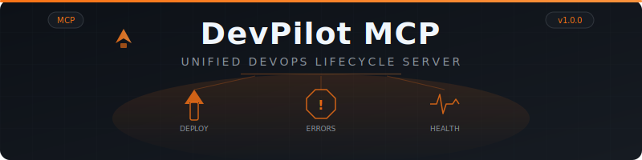
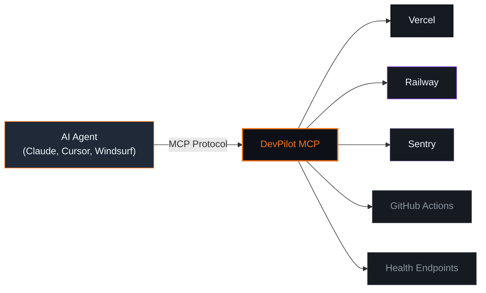

<div align="center">



<br/>
<br/>

[](https://npmjs.com/package/devpilot-mcp)
[](LICENSE)
[]()
[]()
[]()
[]()

**Replace 6 DevOps tools with one MCP server.**
<br/>
Deploy, monitor, rollback, and audit your entire DevOps lifecycle through a single AI-native interface.

[Quick Start](#-quick-start) · [Tools](#-tools) · [Pro Features](#-pro-features) · [Security](#-security) · [Architecture](#-architecture)

<br/>

</div>

---

## See it in action

```
 Agent     "Deploy main to production and verify everything looks good"

 DevPilot  deploy_pipeline({
             repo: "acme/api",
             branch: "main",
             provider: "vercel",
             project_id: "acme-api",
             test_workflow: "ci.yml",
             health_url: "https://api.acme.com/health",
             sentry_project_slug: "acme-api"
           })

 Pipeline:

 Step              Status    Duration
 run_tests         success     42.1s
 trigger_deploy    success      1.2s
 health_check      success      0.3s
 error_check       success      0.8s

 Overall: success — deployed dpl_8xKpQ2 in 44.4s
```

```
 Agent     "We have an incident — what changed in the last hour?"

 DevPilot  incident_report({ project_slug: "acme-api", timeframe: "1h" })

 Timeline:

 14:02  deploy   dpl_7mNR9  branch: hotfix/auth — ready in 28s
 14:07  error    TypeError: Cannot read properties of undefined (reading 'user')
 14:07  error    UnhandledPromiseRejection in /api/auth/callback (×14)

 Correlations:

 TypeError: Cannot read ...   deploy dpl_7mNR9   confidence: HIGH
 Reason: errors appeared 5 minutes after deployment on same branch

 2 errors correlated — 2 high confidence
```

---

## Architecture



---

## Quick Start

```bash
npx devpilot-mcp
```

<details>
<summary><strong>Claude Desktop</strong></summary>

Add to your `claude_desktop_config.json`:

- **macOS / Linux:** `~/.config/Claude/claude_desktop_config.json`
- **Windows:** `%APPDATA%\Claude\claude_desktop_config.json`

```json
{
  "mcpServers": {
    "devpilot": {
      "command": "npx",
      "args": ["devpilot-mcp"],
      "env": {
        "VERCEL_TOKEN": "your-vercel-token",
        "RAILWAY_TOKEN": "your-railway-token",
        "SENTRY_TOKEN": "your-sentry-token",
        "SENTRY_ORG": "your-sentry-org",
        "GITHUB_TOKEN": "your-github-token"
      }
    }
  }
}
```

</details>

<details>
<summary><strong>Cursor</strong></summary>

Add to `.cursor/rules/mcp_servers.json` in your project root:

```json
{
  "mcpServers": {
    "devpilot": {
      "command": "npx",
      "args": ["devpilot-mcp"],
      "env": {
        "VERCEL_TOKEN": "your-vercel-token",
        "GITHUB_TOKEN": "your-github-token"
      }
    }
  }
}
```

</details>

<details>
<summary><strong>Windsurf</strong></summary>

Open settings (`Cmd+Shift+P` / `Ctrl+Shift+P` then search "MCP") and add:

```json
{
  "mcpServers": {
    "devpilot": {
      "command": "npx",
      "args": ["devpilot-mcp"],
      "env": {
        "VERCEL_TOKEN": "your-vercel-token",
        "GITHUB_TOKEN": "your-github-token"
      }
    }
  }
}
```

</details>

<details>
<summary><strong>With Pro License</strong></summary>

Set the `PRO_LICENSE` environment variable to unlock premium tools:

```json
{
  "mcpServers": {
    "devpilot": {
      "command": "npx",
      "args": ["devpilot-mcp"],
      "env": {
        "PRO_LICENSE": "CPK-your-license-key",
        "VERCEL_TOKEN": "your-vercel-token",
        "RAILWAY_TOKEN": "your-railway-token",
        "SENTRY_TOKEN": "your-sentry-token",
        "SENTRY_ORG": "your-sentry-org",
        "GITHUB_TOKEN": "your-github-token"
      }
    }
  }
}
```

Or from the command line:

```bash
PRO_LICENSE=CPK-your-license-key npx devpilot-mcp
```

</details>

### Environment Variables

| Variable | Required For | Description |
|:---------|:-------------|:------------|
| `VERCEL_TOKEN` | Vercel tools | Personal access token from vercel.com/account/tokens |
| `RAILWAY_TOKEN` | Railway tools | API token from railway.app/account/tokens |
| `SENTRY_TOKEN` | Sentry tools | Auth token from sentry.io/settings/auth-tokens |
| `SENTRY_ORG` | Sentry tools | Organization slug from sentry.io/settings |
| `GITHUB_TOKEN` | GitHub Actions tools | Personal access token with `workflow` scope |
| `PRO_LICENSE` | Pro tools | License key from Gumroad or MCPize |

---

## Tools

### Free Tools (6)

| Tool | Provider | Description |
|:-----|:---------|:------------|
| **`deploy_status`** | Vercel / Railway | Get recent deployments with state, URL, branch, and timing |
| **`trigger_deploy`** | Vercel / Railway | Trigger a new deployment for a project and branch |
| **`get_errors`** | Sentry | Fetch recent error events with title, count, level, and stack trace |
| **`run_tests`** | GitHub Actions | Trigger a CI workflow and return run ID, URL, and status |
| **`deployment_logs`** | Vercel / Railway | Fetch build and runtime logs for a specific deployment |
| **`health_check`** | HTTP | Check one or more URLs — returns up/down, response time, status code |

### Pro Features (6)

| Tool | Provider | Description |
|:-----|:---------|:------------|
| **`rollback_deploy`** | Vercel / Railway | Roll back to the previous (or specified) deployment |
| **`incident_report`** | Sentry + Vercel | Correlate errors with recent deployments — returns confidence-scored timeline |
| **`deploy_pipeline`** | All | Full pipeline: test → deploy → health check → error check |
| **`cost_monitor`** | Vercel / Railway | Infrastructure cost breakdown and trend over 7d / 30d / 90d |
| **`environment_sync`** | Vercel / Railway | Diff env vars across environments — values are never exposed |
| **`audit_trail`** | Internal | Query the DevPilot audit log for all tool calls and outcomes |

---

## Feature Comparison

<table>
<tr>
<th>Capability</th>
<th align="center">Free</th>
<th align="center">Pro</th>
</tr>
<tr><td><strong>Deployment Status</strong> &amp; listing</td><td align="center">&#9989;</td><td align="center">&#9989;</td></tr>
<tr><td><strong>Trigger Deployments</strong></td><td align="center">&#9989;</td><td align="center">&#9989;</td></tr>
<tr><td><strong>Error Monitoring</strong> (Sentry)</td><td align="center">&#9989;</td><td align="center">&#9989;</td></tr>
<tr><td><strong>CI Workflows</strong> (GitHub Actions)</td><td align="center">&#9989;</td><td align="center">&#9989;</td></tr>
<tr><td><strong>Deployment Logs</strong></td><td align="center">&#9989;</td><td align="center">&#9989;</td></tr>
<tr><td><strong>Health Checks</strong></td><td align="center">&#9989;</td><td align="center">&#9989;</td></tr>
<tr><td colspan="3"></td></tr>
<tr><td><strong>Rollback Deployments</strong></td><td align="center">&#10060;</td><td align="center">&#9989;</td></tr>
<tr><td><strong>Incident Reports</strong> with error-deploy correlation</td><td align="center">&#10060;</td><td align="center">&#9989;</td></tr>
<tr><td><strong>Full Deploy Pipeline</strong> (test → deploy → verify)</td><td align="center">&#10060;</td><td align="center">&#9989;</td></tr>
<tr><td><strong>Cost Monitoring</strong></td><td align="center">&#10060;</td><td align="center">&#9989;</td></tr>
<tr><td><strong>Environment Variable Sync</strong></td><td align="center">&#10060;</td><td align="center">&#9989;</td></tr>
<tr><td><strong>Audit Trail</strong></td><td align="center">&#10060;</td><td align="center">&#9989;</td></tr>
</table>

---

## Provider Support

<table>
<tr>
<th>Feature</th>
<th align="center">Vercel</th>
<th align="center">Railway</th>
<th align="center">Sentry</th>
<th align="center">GitHub Actions</th>
</tr>
<tr><td>Deployment Status</td><td align="center">&#9989;</td><td align="center">&#9989;</td><td align="center">&#10060;</td><td align="center">&#10060;</td></tr>
<tr><td>Trigger Deploy</td><td align="center">&#9989;</td><td align="center">&#9989;</td><td align="center">&#10060;</td><td align="center">&#10060;</td></tr>
<tr><td>Deployment Logs</td><td align="center">&#9989;</td><td align="center">&#9989;</td><td align="center">&#10060;</td><td align="center">&#10060;</td></tr>
<tr><td>Rollback</td><td align="center">&#9989;</td><td align="center">&#9989;</td><td align="center">&#10060;</td><td align="center">&#10060;</td></tr>
<tr><td>Cost Monitor</td><td align="center">&#9989;</td><td align="center">&#9989;</td><td align="center">&#10060;</td><td align="center">&#10060;</td></tr>
<tr><td>Environment Sync</td><td align="center">&#9989;</td><td align="center">&#9989;</td><td align="center">&#10060;</td><td align="center">&#10060;</td></tr>
<tr><td>Error Monitoring</td><td align="center">&#10060;</td><td align="center">&#10060;</td><td align="center">&#9989;</td><td align="center">&#10060;</td></tr>
<tr><td>Incident Correlation</td><td align="center">&#9989; source</td><td align="center">&#10060;</td><td align="center">&#9989; errors</td><td align="center">&#10060;</td></tr>
<tr><td>CI Trigger / Run Tests</td><td align="center">&#10060;</td><td align="center">&#10060;</td><td align="center">&#10060;</td><td align="center">&#9989;</td></tr>
</table>

---

## Security

<div align="center">

[]()
[]()
[](LICENSE)
[]()

</div>

| Principle | Details |
|:----------|:--------|
| **No stored credentials** | API tokens are passed via environment variables — DevPilot never stores or transmits them |
| **Values never exposed** | `environment_sync` compares key names only — env var values are masked and never returned |
| **Audit trail** | Every Pro tool call is logged to a local SQLite audit log for compliance review |
| **Per-call token injection** | Tokens are read from `process.env` at call time — rotate without restarting the server |
| **No telemetry** | Zero analytics, zero phone-home. All data stays in your environment |

### Best Practices

```bash
# Never hardcode tokens — use environment variables
VERCEL_TOKEN=xxx GITHUB_TOKEN=yyy npx devpilot-mcp

# Use scoped tokens with minimal permissions
# Vercel: read-only token for deploy_status, full token for trigger_deploy
# GitHub: token with only workflow scope for run_tests

# Review the audit log regularly (Pro)
# → call audit_trail({ timeframe: "7d" })
```

---

## Pro License

Unlock rollback, incident reports, full deploy pipelines, cost monitoring, environment sync, and the audit trail.

**Get your license:**
- [Gumroad](https://gumroad.com) — Instant delivery
- [MCPize](https://mcpize.com/mcp/devpilot-mcp) — MCP marketplace

```bash
# Activate
export PRO_LICENSE=CPK-your-license-key
npx devpilot-mcp

# Or inline
PRO_LICENSE=CPK-your-license-key npx devpilot-mcp
```

---

<div align="center">

**Built by [Craftpipe](https://craftpipe.dev)** — AI-powered developer tools

[GitHub](https://github.com/AuditSite/devpilot-mcp) · [npm](https://npmjs.com/package/devpilot-mcp) · [Support](mailto:support@craftpipe.dev)

<sub>MIT License &copy; 2026 Craftpipe</sub>

</div>
